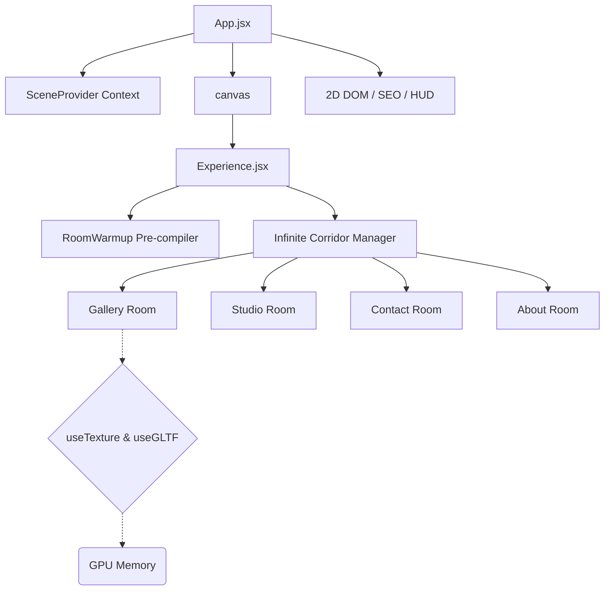

# 💍 Scott & Georgina's Wedding | Interactive 3D WebGL Wedding Website

<div align="center">
  
  
  
  
  
</div>

<br/>

Welcome to the repository for **Scott & Georgina's Wedding** website. This project pushes the limits of modern web technologies by blending spatial WebGL computing, complex React ecosystems, and highly optimized frontend engineering — repurposed from an interactive 3D portfolio template into a wedding site.

> [!TIP]
> Personalizing the visuals? See [IMAGES_TO_CUSTOMIZE.md](IMAGES_TO_CUSTOMIZE.md) for a categorized checklist of exactly which images in `public/` need to change vs. which generic decoration can stay as-is.

> [!NOTE]
> Ensure hardware acceleration is enabled in your browser settings to experience the smooth 60 FPS high-tier rendering of this application.

## 🔑 Environment Variables

Set these in a local `.env` file (not committed) and in your host's dashboard for production:

| Variable | Purpose |
|---|---|
| `VITE_WEB3FORMS_KEY` | API key for the contact/RSVP form (Web3Forms) |
| `VITE_SITE_URL` | Your deployed domain, e.g. `https://scottandgeorgina.wedding` (no trailing slash). Once set, `og:image`/`og:url` become absolute URLs, which social apps (iMessage, Slack, Facebook, etc.) require to show a link preview. Leave unset while you don't have a domain yet — the site works fine, link previews just won't render until it's set. |


## 🚀 Key Performance Architectures (2026 Standards)

This application is strictly optimized for cross-device operability, achieving zero lag spikes even on mobile processors through several bespoke architectural implementations:

1. **Invisible Semantic SEO Fallback:** Bypasses WebGL canvas SEO limitations via strategic `sr-only-seo` indexing DOM injections, rendering fully visible semantic trees to native search-engine crawlers without mounting heavy bundles.
2. **Asynchronous Shader Compilation:** Enforces `gl.compileAsync` during the Preloading phase inside a hidden `RoomWarmup` Suspense boundary. This allows Three.js to pre-compile complex materials asynchronously without blocking the main React update thread.
3. **Baked Global Tinting & Lighing Extraction:** Replaced real-time WebGL shadow maps and infinite light rays with baked-in global textures (`apply_global_tint.js`), dropping the GPU compute overhead entirely while maintaining visual depth.
4. **DOM Mutation Bypassing:** Critical animation properties (like SVG preloader states tracking 130+ concurrent HTTP texture requests) write directly to the `ref.current.style`, intentionally bypassing React’s `setState` render cycles to conserve CPU.
5. **Adaptive Device Tiering:** Auto-detects `navigator.deviceMemory`, hardware concurrency, and viewport sizes to scale WebGL resolutions (`dpr`), antialiasing algorithms, and texture loading strictness on the fly.

---

## 🏗️ 3D Scene Architecture



---

## 🛠️ Local Development Setup

To run this application natively on your local machine:

1. **Clone the repository:**
   ```bash
   git clone https://github.com/scottjones03/wedding.git
   cd wedding
   ```

2. **Install dependencies:**
   Make sure you are on Node.js v20+.
   ```bash
   npm install
   ```

3. **Start the local Dev Server:**
   ```bash
   npm run dev
   ```

> [!IMPORTANT]
> Since this project heavily utilizes `vite-plugin-compression` and hundreds of high-res textures, your initial local load might take a few seconds as the dev-server buffers asset delivery. For performance testing, always run `npm run build && npm run preview`.

---

## Cloudflare Pages Deployment

This repo is ready for a standard Cloudflare Pages Git deployment.

Use these build settings in the Cloudflare dashboard:

- Framework preset: `Vite`
- Build command: `npm run build`
- Build output directory: `dist`
- Root directory: `/`

Add these environment variables for both Production and Preview:

- `VITE_WEB3FORMS_KEY`
- `VITE_SITE_URL`
- `VITE_POSTHOG_KEY` and `VITE_POSTHOG_HOST` if analytics are enabled
- `NODE_VERSION=22`

The `portfolio-itom` folder is a separate Sanity Studio project and should not be used as the Pages root.

## 🤝 Contributing & Feedback

All PRs improving the shader physics, 3D math logic, or component memoization runtimes are welcome. Please refer to our new `.github` Issue and Pull Request templates when submitting!

1. Fork the Project
2. Create your Feature Branch (`git checkout -b feature/AmazingRoom`)


## License

The code in this repository is licensed under the [MIT License](LICENSE). 
**Note:** All personal assets, 3D textures, images, and copywriting are copyright of Tomasz Szmajda and may not be reused or reproduced without explicit permission.
3. Commit your Changes (`git commit -m 'feat: Added realistic liquid simulation to Contact Room'`)
4. Push to the Branch (`git push origin feature/AmazingRoom`)
5. Open a Pull Request

---

*Designed and Developed by [Tomasz Szmajda (ITom Dev)](/).*
